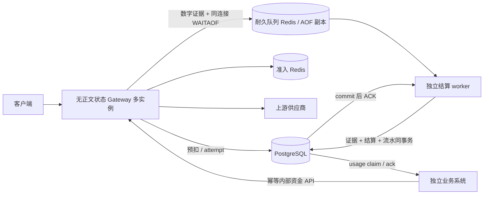
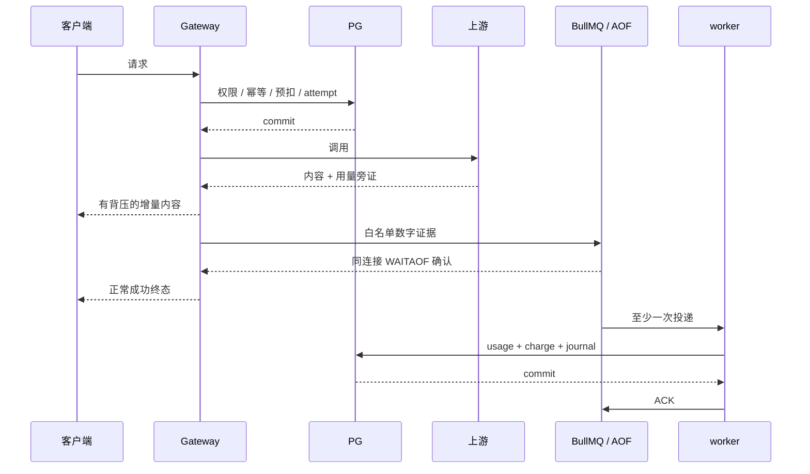

# 当前架构

```mermaid
flowchart LR
  C[客户端] --> G[无正文状态 Gateway 多实例]
  B[独立业务系统] -->|幂等内部资金 API| G
  G -->|预扣 / attempt| P[(PostgreSQL)]
  G --> L[(准入 Redis)]
  G --> U[上游供应商]
  G -->|数字证据 + 同连接 WAITAOF| Q[(耐久队列 Redis / AOF 副本)]
  Q --> W[独立结算 worker]
  W -->|证据 + 结算 + 流水同事务| P
  P -->|commit 后 ACK| W
  P -->|usage claim / ack| B
```

```mermaid
sequenceDiagram
  participant C as 客户端
  participant G as Gateway
  participant P as PG
  participant U as 上游
  participant Q as BullMQ / AOF
  participant W as worker
  C->>G: 请求
  G->>P: 权限 / 幂等 / 预扣 / attempt
  P-->>G: commit
  G->>U: 调用
  U-->>G: 内容 + 用量旁证
  G-->>C: 有背压的增量内容
  G->>Q: 白名单数字证据
  Q-->>G: 同连接 WAITAOF 确认
  G-->>C: 正常成功终态
  Q->>W: 至少一次投递
  W->>P: usage + charge + journal
  P-->>W: commit
  W->>Q: ACK
```

JSON 在落盘确认后返回；SSE 成功终态在确认后交付。模型正文只在有界内存经过。队列尚未入 PG 的证据不能从 PG 重建。
