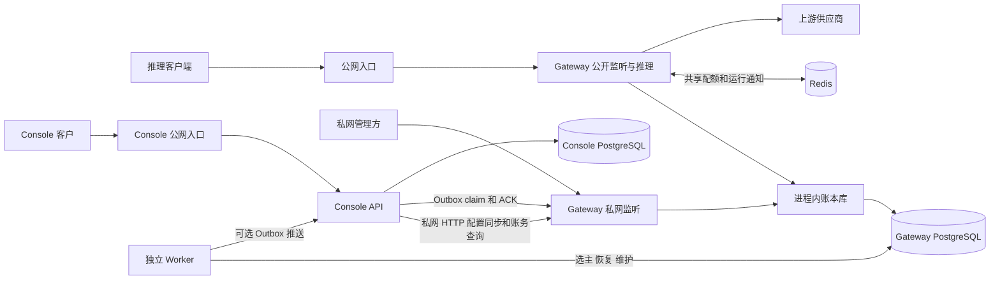
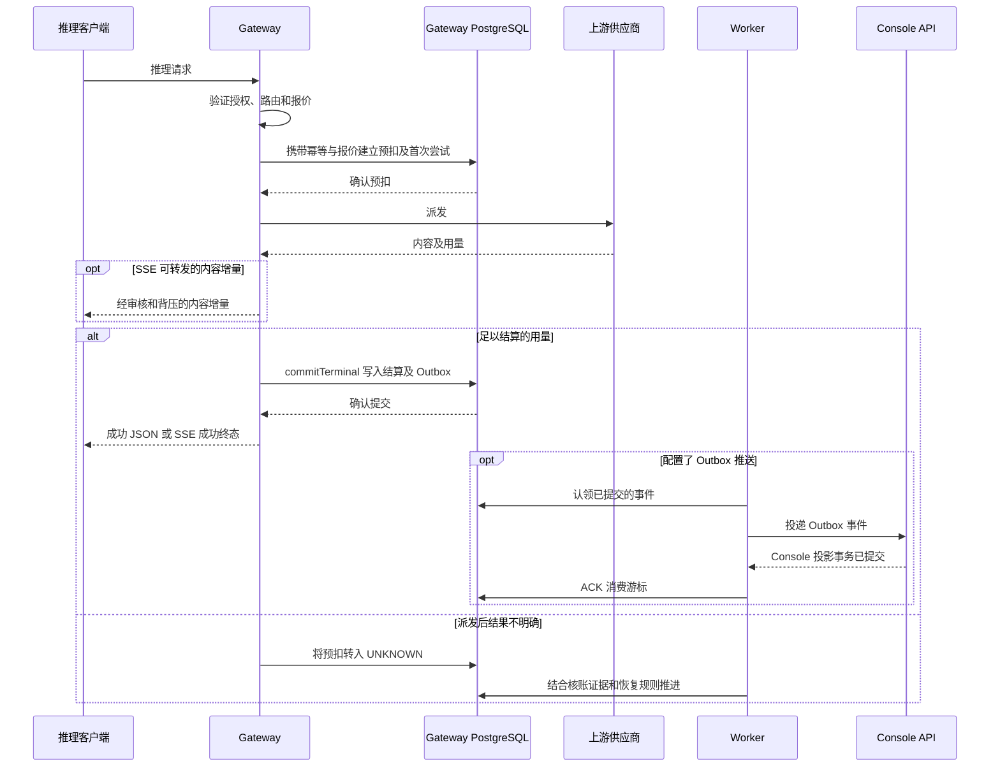

# 当前架构图

节点与数据所有权见 [系统架构](architecture.md)。

```mermaid
flowchart LR
  Client[推理客户端] --> Entry[公网入口]
  Customer[Console 客户] --> ConsoleEntry[Console 公网入口]
  Operator[私网管理方] --> Admin[Gateway 私网监听]
  Entry --> Gateway[Gateway 公开监听与推理]
  ConsoleEntry --> Console[Console API]
  Console -->|私网 HTTP 配置同步和账务查询| Admin
  Gateway --> Ledger[进程内账本库]
  Admin --> Ledger
  Ledger --> GatewayDB[(Gateway PostgreSQL)]
  Gateway <-->|共享配额和运行通知| Redis[(Redis)]
  Gateway --> Provider[上游供应商]
  Worker[独立 Worker] -->|选主 恢复 维护| GatewayDB
  Worker -->|可选 Outbox 推送| Console
  Console -->|Outbox claim 和 ACK| Admin
  Console --> ConsoleDB[(Console PostgreSQL)]
```

本地 `all-in-one` 模式把同一 Worker 装入 Gateway 进程。生产采用独立 Worker。Console 与 Gateway 通过接口交换配置和事件。

```mermaid
sequenceDiagram
  participant C as 推理客户端
  participant G as Gateway
  participant P as Gateway PostgreSQL
  participant U as 上游供应商
  participant W as Worker
  participant B as Console API
  C->>G: 推理请求
  G->>G: 验证授权、路由和报价
  G->>P: 携带幂等与报价建立预扣及首次尝试
  P-->>G: 确认预扣
  G->>U: 派发
  U-->>G: 内容及用量
  opt SSE 可转发的内容增量
    G-->>C: 经审核和背压的内容增量
  end
  alt 足以结算的用量
    G->>P: commitTerminal 写入结算及 Outbox
    P-->>G: 确认提交
    G-->>C: 成功 JSON 或 SSE 成功终态
    opt 配置了 Outbox 推送
      W->>P: 认领已提交的事件
      W->>B: 投递 Outbox 事件
      B-->>W: Console 投影事务已提交
      W->>P: ACK 消费游标
    end
  else 派发后结果不明确
    G->>P: 将预扣转入 UNKNOWN
    W->>P: 结合核账证据和恢复规则推进
  end
```
